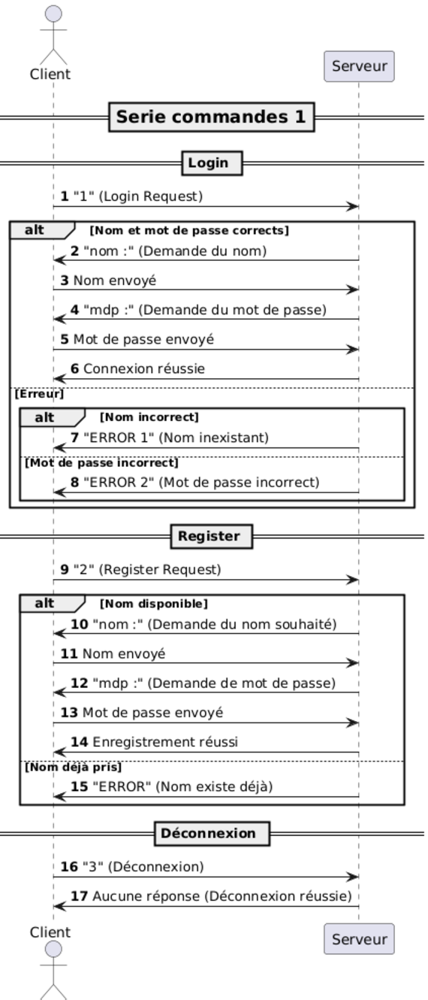
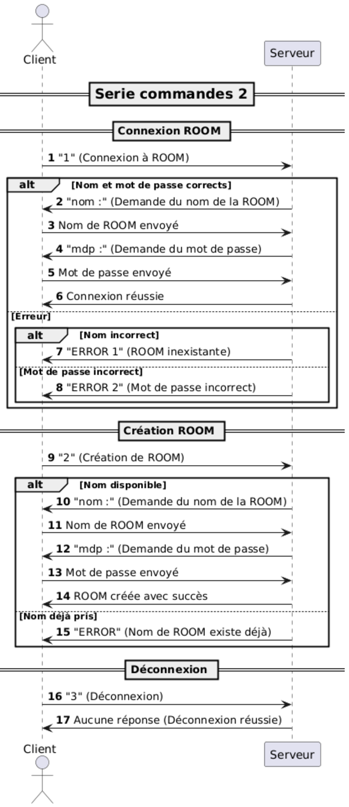
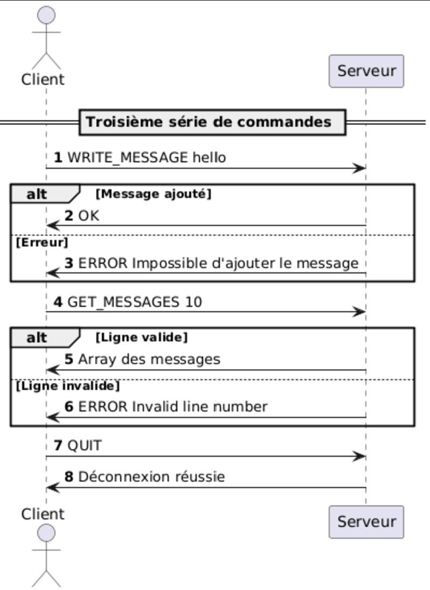
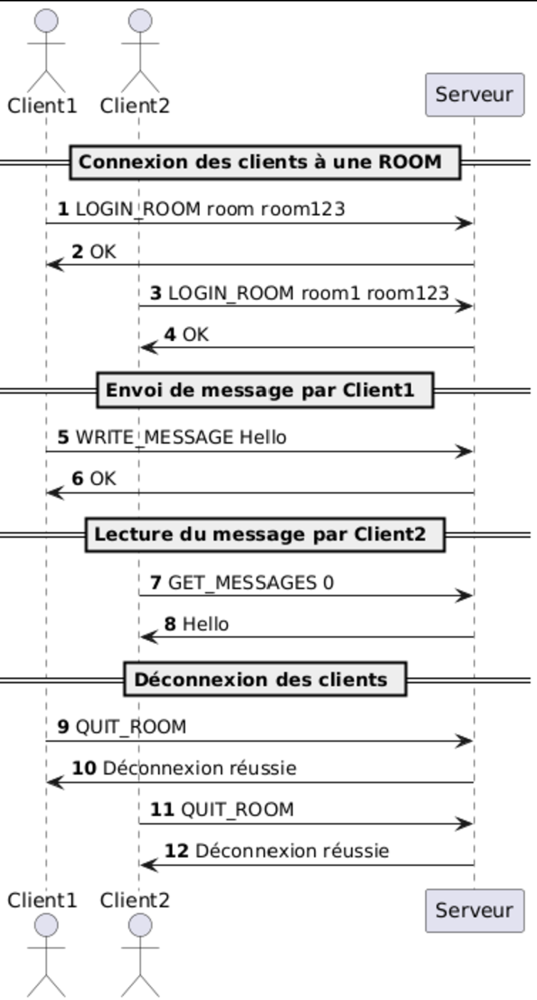

# THE "ROOM MESSENGER" PROTOCOL

## Section 1 - Overview

Le "ROOM messenger" protocol est un protocol permettant une discussion entre un nombre indéfini de personnes au travers de ROOMS.

## Section 2 - Transport protocol

Ce protocol utilise TCP pour la communication.\
L'adresse IP connectée par défaut est "localhost", mais chaque client peut utiliser une autre adresse si il le souhaite.\
Pour ce qui est du port, le protocol se connecte par défaut au port 1234 mais comme pour l'adresse IP, le client peut choisir
le port de connexion.\
Les messages sont encodés en UTF-8, permettant l'utilisation de symboles dans les message et sont délimités par \u0004 (EOF)\
Le client se connecte au serveur grâce à son pseudo et son mot de passe. Il a également la possibilité de créer ces derniers
si c'est sa première connexion.\
Si lors d'une connexion le nom d'utilisateur n'existe pas ou que le mot de passe entrée est faux, une erreur sera envoyée au client.\
Pareil pour une première connexion, si le nom entrée existe déjà, une erreur sera envoyée au client.\
Il pourra ensuite se connecter à une ROOM ou en créer une, au choix.\
Si la ROOM n'existe pas ou que le mot de passe entré est faux, une erreur sera envoyée au client.\
Chaque ROOM est définie par un nom et un mot de passe permettant d'y accéder.\
Lorsqu'un client rejoins une ROOM, il peut alors soit envoyer des messages, soit demander de recevoir les messages ayant été écrits dans la ROOM
ou encore un historique complet des discussions de cette ROOM. \
Le client peut quitter la ROOM quand il le souhaite.


## Section 3 - Messages

### Première serie de commande :
### Login
Le client se login au serveur

#### Request

```text
LOGIN_USER <login> <password>
```
#### Response
- `OK`

- `ERROR <errormessage>` : une erreur est apparue. Le message d'erreur peut être :
  - Invalid login : le login n'existe pas
  - Invalid password : le mdp est incorrect


### Register
Le client se register au serveur

#### Request
```text
REGISTER_USER <login> <password>
```
#### Response
- `OK`
- `ERROR User already exists` : une erreur apparaît si le nom entré existe déjà


### Déconnexion
Le client se déconnecte

#### Request
```text
QUIT
```
#### Response
None.


### Deuxième serie de commande :
### Connexion ROOM
Le client se connecte à une ROOM

#### Request

```text
LOGIN_ROOM <name> <password>
```

#### Response
- `OK`
- `ERROR <error message>` : une erreur est apparue. Le code message d'erreur peut-être :
  - Invalid password : le nom entré ne correspond à aucune ROOM
  - Invalid ROOM name : le mot de passe est incorrect


### Création ROOM
Le client crée une ROOM

#### Request
```text
REGISTER_ROOM <nom> <mdp>
```

1. `nom :` : le est client prié d'indiquer le nom de la ROOM.\
2. `mdp :` : le est client prié de créer un nouveau mot de passe.\

#### Response
- `OK`
- `ERROR <error message>` : une erreur apparaît si le nom entré existe déjà
  (1) Impossible de créer la salle : le nom entré ne correspond à aucune ROOM\
  (2) ROOM alrready exists : le mot de passe est incorrect\


### Déconnexion
Le client se déconnecte

#### Request
```text
QUIT
```
#### Response
None.


### Troisième serie de commande :
### Ecriture de message
Le client écrit un message dans une ROOM

#### Request

```text
WRITE_MESSAGE <message>
```
#### Response
- `OK` 
- `ERROR Impossible d'ajouter le message` : une erreur est apparue car le message ne s'est pas envoyé correctement.


### Lecture de message
Le client lit un message dans une ROOM

#### Request
```text
GET_MESSAGES <first line>
```
#### Response
- Le serveur envoie au client un array des messages écrits sur la ROOM, à partir de la line indiquée.
- `ERROR Invalid line number` : une erreur apparaît car il y a eu un problème lors de la lecture d'un message.


### Déconnexion de la ROOM
Le client se déconnecte de la ROOM

#### Request
```text
QUIT
```
#### Response
- None. 

## Section 4 - Examples

### Exemple première serie de commande :



### Exemple deuxième serie de commande :



### Exemple troisième serie de commande :



### Exemple discussion entre 2 clients :

